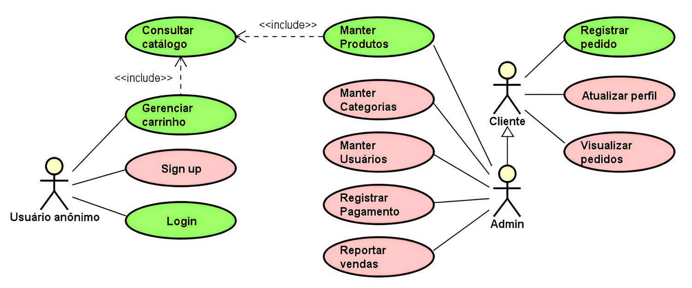

[](https://github.com/matheusvidal21/DSCommerce)

<h1 align="center">CoreCommerce</h1>

<p align='center'> 
    
    
    
</p>    

<p align="center">
  
</p>

# 🔍 Visão Geral
O sistema **CoreCommerce** deve manter um cadastro de usuários, produtos e suas categorias.

Cada usuário possui nome, e-mail, telefone, data de nascimento e uma senha de acesso. Os dados dos produtos incluem nome, descrição, preço e imagem.

O sistema apresenta um catálogo de produtos que pode ser filtrado pelo nome. A partir desse catálogo, o usuário pode selecionar um produto para ver seus detalhes e decidir se o adiciona ao carrinho de compras. É possível incluir e remover itens do carrinho, bem como alterar suas quantidades. Quando o usuário finaliza o pedido, ele é salvo com o status de **"aguardando pagamento"**.

Os dados de um pedido incluem:

• Instante em que foi salvo  
• Status  
• Lista de itens, com produto e quantidade


O status de um pedido pode ser:

• Aguardando pagamento  
• Pago  
• Enviado  
• Entregue  
• Cancelado

Ao pagar por um pedido, o instante do pagamento é registrado.

Os usuários podem ser clientes ou administradores. Por padrão, todo usuário cadastrado é cliente. Usuários não identificados podem se cadastrar, navegar no catálogo e usar o carrinho. Clientes podem atualizar seu cadastro, registrar pedidos e visualizar seus próprios pedidos. Administradores têm acesso à área administrativa, com gestão de usuários, produtos e categorias.

A API **CoreCommerce** é documentada via **Swagger**, permitindo a visualização e teste dos endpoints de forma prática.

## Índice
- 🧠 [Modelo conceitual](#-modelo-conceitual)
- 📑 [Casos de Uso](#-casos-de-uso)
- 💻 [Tecnologias utilizadas](#-tecnologias-utilizadas)
- 🔧 [Como executar](#-como-executar)
- 🛠️ [Testando a API com o Postman](#%EF%B8%8F-testando-a-api-com-o-postman)
- 👥 [Autor](#-autor)

# 🧠 Modelo conceitual
- Este é o modelo conceitual do sistema CoreCommerce. Considerações: Cada item de pedido (OrderItem) corresponde a um produto no pedido, com uma quantidade. Sendo que o preço também é armazenado no item de pedido por
questões de histórico (se o preço do produto mudar no futuro, o preço do item de pedido continua registrado com o preço real que foi vendido na época).

- Um usuário pode ter um ou mais "roles", que são os perfis de acesso deste usuário no sistema (client, admin).

<p align="center">
  
</p>

 
# 📑 Casos de Uso
O CoreCommerce possui um conjunto de casos de uso que abrangem as principais funcionalidades do sistema. Eles incluem desde a navegação no catálogo de produtos até as operações administrativas.

## Visão geral
| Caso de uso | Visão geral | Acesso |
|----------|----------|----------|
| Manter produtos | CRUD de produtos, podendo filtrar itens pelo nome | Somente Admin |
| Manter categorias | CRUD de categorias, podendo filtrar itens pelo nome | Somente Admin |
| Manter usuários | CRUD de usuários, podendo filtrar itens pelo nome | Somente Admin |
| Gerenciar carrinho | Incluir e remover itens do carrinho de compras, bem como alterar as quantidades do produto em cada item | Público |
| Consultar catálogo | Listar produtos disponíveis, podendo filtrar produtos pelo nome | Público |
| Sign up | Cadastrar-se no sistema | Público |
| Login | Efetuar login no sistema | Público |
| Registrar pedido | Salvar no sistema um pedido a partir dos dados do carrinho de compras informado | Usuário logado |
| Atualizar perfil | Atualizar o próprio cadastro | Usuário logado |
| Visualizar pedidos | Visualizar os pedidos que o próprio usuário já fez | Usuário logado |
| Registrar pagamento | Salvar no sistema os dados do pagamento de um pedido | Somente Admin |
| Reportar pedidos | Relatório de pedidos, podendo ser filtrados por data | Somente Admin |

<p align="center">
  
</p>

## Atores

| Ator | Responsabilidade | 
|----------|----------|
| Usuário anônimo | Pode realizar casos de uso das áreas públicas do sistema, como catálogo, carrinho de compras, login e sign up |
| Cliente | Responsável por manter seu próprios dados pessoais no sistema, e pode visualizar histórico dos seus pedidos. Todo usuário cadastrado por padrão é um Cliente | 
| Admin | Responsável por acessar a área administrativa do sistema com cadastros e relatórios. Admin também pode fazer tudo que Cliente faz | 

## Detalhamento
1. Consultar catálogo
- Atores: Usuário anônimo, Cliente, Admin
- Precondições: -
- Pós-condições: -
- Visão geral: Listar produtos disponíveis, podendo filtrar produtos pelo nome

2. Manter produtos
- Atores: Admin
- Precondições: Usuário logado
- Pós-condições: -
- Visão geral: CRUD de produtos, podendo filtrar itens pelo nome

4. Login
- Atores: Usuário anônimo
- Precondições: -
- Pós-condições: Usuário logado
- Visão geral: Efetuar login no sistema

6. Gerenciar carrinho
- Atores: Usuário anônimo
- Precondições: -
- Pós-condições: -
- Visão geral: Incluir e remover itens do carrinho de compras, bem como alterar as quantidades do produto em cada item

6. Registrar pedido
- Atores: Cliente
- Precondições: Usuário logado, Carrinho de compras não vazio
- Pós-condições: Carrinho de compras vazio
- Visão geral: Salvar no sistema um pedido a partir dos dados do carrinho de compras informado.

# 💻 Tecnologias utilizadas


# 🔧 Como executar?
Segue abaixo as instruções para executar o projeto:

## Pré-requisitos
- Certifique-se de ter o Java JDK instalado na sua máquina
- Instale o IntelliJ IDEA ou outra IDE de sua preferência para desenvolvimento Java
- É necessário ter o Maven instalado em sua máquina

### Passo 1: Clonar o Repositório
```
git clone git@github.com:oryanend/CoreCommerce.git
```

### Passo 2: Importar o Projeto
- Abra o Intellij IDEA ou sua IDE de preferência
- Selecione "Open" no menu e escolha o diretório do projeto clonado
- Aguarde até que o IntelliJ configure o projeto

### Passo 3: Configuração
- Verifique se todas as dependências foram carregadas corretamente pelo Maven 

### Passo 4: Execução
- Localize a classe principal da aplicação `DscommerceApplication`(localizado em src/main/java/com/devsuperior/dscommerce) e execute-a
- Ou, se preferir utilizar o Maven, você pode executar o projeto a partir da linha de comando:
```
mvn spring-boot:run
```

### Passo 5: Acesso à Aplicação
- Uma vez que a aplicação esteja em execução, você pode interagir com ela consumindo os endpoints da API. Para isso, recomenda-se o uso de ferramentas como o Postman, que permite fazer requisições HTTP de forma fácil e eficiente
- Se preferir, também é possível acessá-la através do navegador web, digitando o endereço <b> `http://localhost:8080` na barra de endereços

# 🛠️ Testando a API com o Postman
Para facilitar o teste dos endpoints da API, disponibilizei uma coleção e um ambiente (environment) no Postman contendo todas as requisições disponíveis. Siga os passos abaixo para importar a coleção e começar a testar:
1. Baixe e Instale o Postman
- Se você ainda não tem o Postman instalado, você pode baixá-lo e instalá-lo gratuitamente a partir do [site oficial](https://www.postman.com/downloads/)
2. Importe a collection e o environment
- Após instalar o Postman, faça o download da coleção que disponibilizei. Você pode encontrá-la [aqui](docs/postman/DSCommerce.postman_collection.json)
- Também faça o download do ambiente (environment) localizado [aqui](docs/postman/DSCommerce%20auth.postman_environment.json)
3. Importe no Postman
- Abra o Postman e clique no botão "File" localizado no canto superior esquerdo da interface. Em seguida, selecione a opção "Import" e depois localize os dois arquivos e selecione-os
4. Teste os Endpoints
- Agora que a coleção foi importada com sucesso, você verá todas as requisições listadas no painel esquerdo do Postman. Basta selecionar a requisição desejada e clicar em "Send" para testá-la
- Na parte superior direita do Postman, você verá um dropdown com a lista de environments. Selecione o environment recém-importado
  
Com a coleção disponível no Postman, você poderá testar facilmente todos os endpoints da sua API e garantir que ela esteja funcionando corretamente.

# 👥 Autor
| [<br><sub>Ryan Oliveira</sub>](https://github.com/oryanend) |
| :---: |
